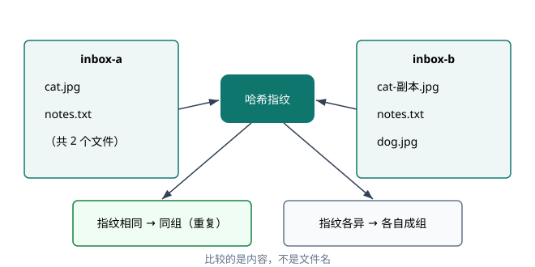

# 第一章 · 去重：哈希指纹与重复文件

## 处境：两堆文件的困局

你的硬盘里通常堆着两批来源不同但内容高度重叠的文件。一批是从旧电脑拷贝出来的备份目录，另一批是最近几个月微信、浏览器下载与相机导出的混合文件夹。你很清楚里面散落着大量重复照片与文档，它们白白吃掉几十个千兆字节的存储空间。

人工核对很快会陷入停滞。最直观的做法是在资源管理器里按名称排序：如果两个文件都叫 `notes.txt`，你不敢直接删掉其中一个，因为同名文件可能记录着截然不同的备忘；如果一张照片叫 `cat.jpg`，另一张叫 `cat-copy.jpg`，或者被重命名为带括号的序号，仅凭肉眼根本无法断定它们是否完全一致。

若用程序逐字节比对，只要文件数量上升到几千个，两两比对的时间复杂度就会达到二次方级别。每次比对都要从磁盘反复读取完整内容，机械硬盘会发出剧烈的寻道噪音，固态硬盘则在大量无意义的顺序读中消耗带宽。你需要一种廉价、稳定且绝对确定的判定手段：不必两两核对完整文件，也能瞬间揪出谁和谁的内容完全一致。

## 最小模型：从内容提取「指纹」

解决这个问题的工具是哈希函数。

在工程实践中，你可以把哈希函数视作一台「数字指纹提取机」。无论你塞给它的是几个字节的纯文本短句，还是容量达到数个千兆字节的高清视频，哈希函数都会执行一套固定的不可逆数学变换，最终输出一串固定长度的十六进制字符串。这串字符串被称为该数据的「哈希值」或「摘要」。

作为去重工具，哈希算法具备三条必须依赖的性质：

第一，确定性。只要输入的原始字节完全一致，无论计算多少次、在什么操作系统上运行，得到的哈希值必然完全相同。

第二，雪崩效应。原始数据哪怕只修改了一个比特（例如把英文句号改成逗号），计算出的哈希值也会发生翻天覆地的变化，肉眼看不出两者的任何关联。

第三，抗碰撞性。对于设计良好的哈希算法，在工程可接受的范围内，找到两份内容不同但哈希值完全一样的数据，在计算上是极其困难的。因此，只要两份数据的哈希值一致，我们就可以在极高概率下断定它们的内容完全相同。

这意味着判定重复的标准发生了转移：比对的目标不再是不可靠的「文件名」，也不是沉重的「文件全文」，而是那串轻量的「哈希指纹」。如表 1-1 所示，工业界存在几种常见的哈希算法，它们的输出长度与适用场景各有分工。

表 1-1 常见哈希算法速览

| 算法 | 摘要长度 | 一句话定位 |
| :--- | :--- | :--- |
| MD5 | 128 位 | 已被证明可构造碰撞，仅适合非安全场景 |
| SHA-1 | 160 位 | 同样不推荐用于安全场景，本章去重够用 |
| SHA-256 | 256 位 | 目前的安全默认 |

在去重场景中，我们不需要防范蓄意的密码学攻击，只需识别自然产生的重复数据。SHA-1 的 160 位长度提供了足够宽广的取值空间，同时计算性能优于 SHA-256。整个去重逻辑的工作流如图 1-1 所示。



图 1-1 哈希去重工作流

## 行动：跑通第一次判定

在运行配套脚本之前，请先根据以下设定在脑中做一次预测。

脚本内部预设了五个文件，它们分布在 `inbox-a` 与 `inbox-b` 两个虚拟目录中，具体路径与写入内容如下：

- `inbox-a/cat.jpg`：内容为 `fake-image-bytes-001`
- `inbox-a/notes.txt`：内容为 `todo: finish the chapter`
- `inbox-b/cat-copy.jpg`：内容为 `fake-image-bytes-001`
- `inbox-b/notes.txt`：内容为 `todo: buy milk after lunch`
- `inbox-b/dog.jpg`：内容为 `fake-image-bytes-999`

请回答：扫描完成后，最终会输出几组哈希指纹？哪几个文件会被标记为重复？

> *如果你对预测结果拿不准，或者想不明白为什么文件名毫无参考价值，可以向 AI 发送以下 Prompt：*
>
> *「请扮演一位苏格拉底风格的调试教练。我现在正在学习基于哈希的文件去重。我面对两组文件：一个叫 inbox-a/notes.txt（内容为 todo: finish the chapter），另一个叫 inbox-b/notes.txt（内容为 todo: buy milk after lunch）。请向我提问，引导我自己分析它们在哈希去重中是否会被归为同一组，切勿直接给出答案。」*

现在，打开终端执行仓库提供的示例脚本：

```bash
uv run python examples/01_hash_dedup.py
```

终端将打印出如下真实运行结果：

```text
共 4 组指纹，报告写入 D:\code\loopbook\scratch\ch1\report.txt
81afdbed1653  cat.jpg, cat-copy.jpg  <== 重复
b04961b3bc9e  notes.txt
2d2adc842bfc  dog.jpg
a3e28d1adff7  notes.txt
```

请核对终端输出与你刚才的预测。原本名字完全不同的 cat.jpg 与
cat-copy.jpg 被判定为同一组并打上了重复标记；而两个文件名完全相同
的 notes.txt，却各自拥有完全独立的哈希值，被判定为两份毫无关联的文件。

## 反馈与复盘：解构脚本的四个暗桩

对照真实输出审视代码实现，会发现几个关乎去重准确性与程序健壮性的关键细节。

### 1. 异名同内容与同名异内容

终端输出的四行数据验证了本章的核心前提：文件名只是文件系统层面的指针与标签，与文件内部承载的数据没有任何必然绑定。两个 notes.txt 虽然在各自文件夹内拥有相同的文件名，但一个记录写书计划，一个记录买牛奶。若按文件名去重，其中一个必然被覆盖或误删；相反，cat-copy.jpg 虽然被改了名字，但底层的字节流与 cat.jpg 分毫不差。计算哈希指纹直接穿透了文件名的表象，把判断锚定在数据本质上。

### 2. 流式分块读取的内存边界

在脚本的 `fingerprint` 函数中，读取文件内容并没有直接调用
`path.read_bytes()`，而是采用了迭代器分块方式：

```python
def fingerprint(path: Path) -> str:
    digest = hashlib.sha1()
    with path.open("rb") as fh:
        for chunk in iter(lambda: fh.read(65536), b""):
            digest.update(chunk)
    return digest.hexdigest()
```

这种写法的用意在于内存控制。如果待查重的目录里包含几个容量达到
8GB 的虚拟机镜像或视频素材，直接读取完整字节数组会瞬间申请等量的
物理内存，甚至引发操作系统的内存溢出崩溃。使用
`iter(lambda: fh.read(65536), b"")` 时，Python 每次仅从磁盘读入
64KB 数据送入哈希状态机。更新完内部摘要状态后，该数据块即可被后续
读取覆盖。无论被哈希的文件体积有多大，这个函数的内存占用始终被
压制在 64KB 的常数级别。

### 3. 避免副作用自污染

在 `find_duplicates` 函数中，过滤条件包含这样一行判断：

```python
if path.is_file() and path.name != "report.txt":
```

脚本的运行结果最终会写入工作目录下的 `report.txt`。如果不对该文件
进行显式排除，第一次运行产生的报告就会在第二次运行时被当成待查重
对象读入。如果测试流程反复执行，动态变化的 report.txt 会不断污染
待比对集合，甚至引发因文件写入尚未关闭而导致的读取竞争。保持输入
数据集的纯净，排除自身产生的副作用文件，是文件系统脚本的基本防线。

### 4. 碰撞概率与生日悖论

很多初学者不敢在去重逻辑中彻底信任哈希，总担心「万一两份不同内容
恰好算出相同哈希值怎么办」。以本章使用的 SHA-1 为例，它的输出为
160 位二进制数，可能的结果总共有 `2^160` 种。根据概率论中的生日
悖论，在随机散列的前提下，大约需要收集到 `2^80` 个互不相同的文件
时，出现一对哈希碰撞的概率才会达到百分之五十。`2^80` 大约相当于
1.2 亿亿亿。即便全世界的计算机日夜不停地向你的硬盘写入互不相同的
数据，在人类文明的尺度内，因自然碰撞导致误删文件的概率也远低于
内存硬件发生单比特翻转的概率。在单机去重这个工程语境下，我们可以
把哈希碰撞的概率视为零。

## 变式练习

掌握了哈希指纹模型后，请尝试在脑中推演并解决以下两个结构同构但
表象不同的变式场景。这里只给出业务规则与判据，实现留给你完成。

**变式 1：跨扩展名媒体去重**

场景：你从微信聊天记录导出了大量图片，同时从云盘下载了相册备份。
微信把很多原本是 PNG 格式的截图强制重命名为了 .jpg 后缀；还有些
无损音频，文件后缀被随意改成了 .dat。判据：文件去重的判别标准必须
完全脱离文件后缀与路径。无论扩展名是 .png、.jpg 还是没有任何后缀，
只要计算出的哈希指纹一致，就必须归入同一重复组。在输出重复报告时，
程序需要显式标注出「指纹相同但后缀不一致」的异常项。

**变式 2：网页文章标题去重**

场景：你抓取了多个资讯网站的历史标题，需要清洗掉重复收录的文本
条目。原始数据是一批字符串而非磁盘文件。部分标题存在空格不一致、
半角全角混用、英文字符大小写不统一的问题，例如 Python基础、
python 基础 与 Ｐｙｔｈｏｎ基础。判据：哈希函数对单个比特的差异
极其敏感，直接对原始字符串求哈希会导致去重彻底失效。必须在输入
哈希函数之前建立「文本归一化」流水线：统一转为小写、去除首尾及
中间的多余空白、将全角字符转为半角字符。去重的依据必须是
「归一化处理后的文本哈希指纹」。

## 战略性留白

在本章脚本中，我们直接对扫描到的每一个文件都计算了完整的 SHA-1
哈希值。当扫描对象只有几十或几百个文件时，这种暴力做法毫无破绽。
但如果你的目标盘挂载着 50 万个总计 4TB 的零碎文件，为所有文件
无差别计算哈希将是一场灾难：磁盘需要逐一打开这 50 万个文件并把
4TB 数据完整读入内存，I/O 耗时可能长达数小时。工业级去重工具
绝不会一上来就两两比对完整哈希。一个显而易见的事实是：如果两个
文件的大小连字节数都不相等，它们的内容绝不可能相同。如何先利用
文件系统元数据（文件大小）做粗筛分桶？只有当同一个大小桶内存在
两个或更多文件时，才对桶内成员计算哈希指纹。更进一步，是否可以
先读取文件头部的前 4KB 数据算一个「局部哈希」，只有局部哈希相同
的嫌疑对象才去读完整个文件？这一步工程优化的代价、收益以及最坏
情况下的性能边界，将在后续章节展开。你可以先在自己的电脑上思考：
先判大小再算哈希，可能会带来哪些额外的文件系统读取成本？
